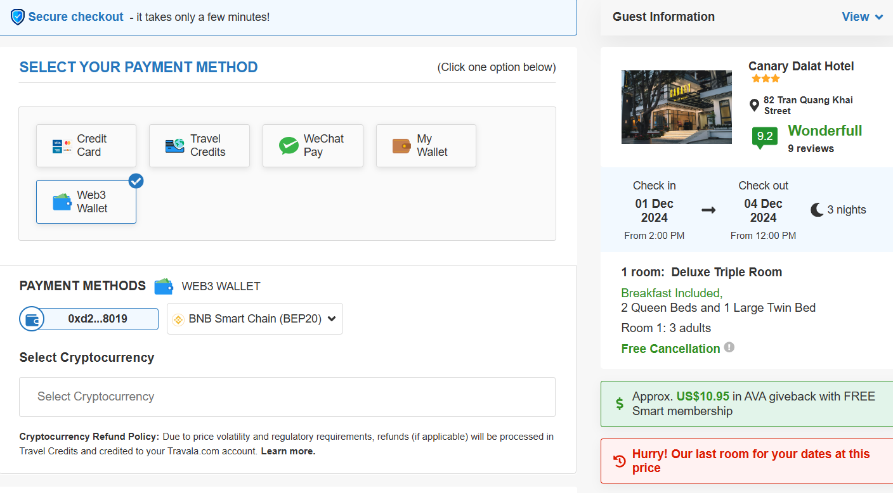

# Checkout

## Description
A checkout form

## Screen



## Source Code

```typescript(source/index.tsx)
import {  Module, Container, customModule } from "@ijstech/components";
import CheckoutMain from "./checkout/index";

@customModule
export default class Checkout extends Module {

  constructor(parent?: Container, options?: any) {
    super(parent, options);
  }

  init() {
    super.init();
  }

  render() {
    return <i-panel width='100%'>
      <i-checkout display='block' width='100%' />
    </i-panel>
  }
}
```
