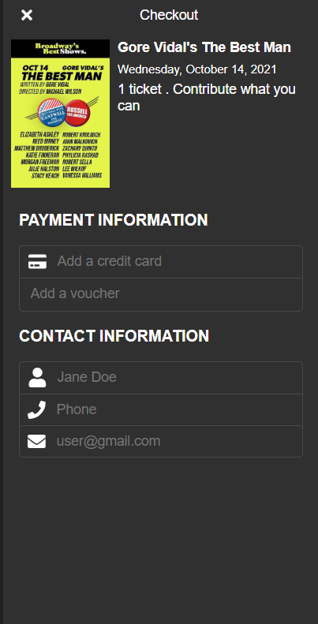

# Payment

## Description
A payment component

## Screens



```typescript(source/home/index.tsx)
import { Styles, Module } from "@ijstech/components";
import { DataModel } from "./model";
const Theme = Styles.Theme.ThemeVars;

export default class Payment extends Module {
  private model: DataModel;
  render() {}
}
```
