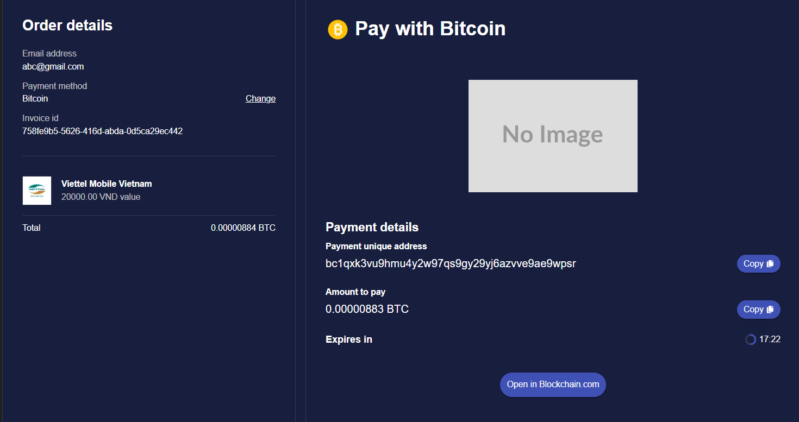

# Payment

## Description
A payment component

## Screen



## Source Code

```typescript(source/index.tsx)
import {  Module, Container, customModule } from "@ijstech/components";
import PaymentMain from "./payment/index";

@customModule
export default class Payment extends Module {

  constructor(parent?: Container, options?: any) {
    super(parent, options);
  }

  init() {
    super.init();
  }

  render() {
    return <i-panel width='100%'>
      <i-payment display='block' width='100%' />
    </i-panel>
  }
}
```
