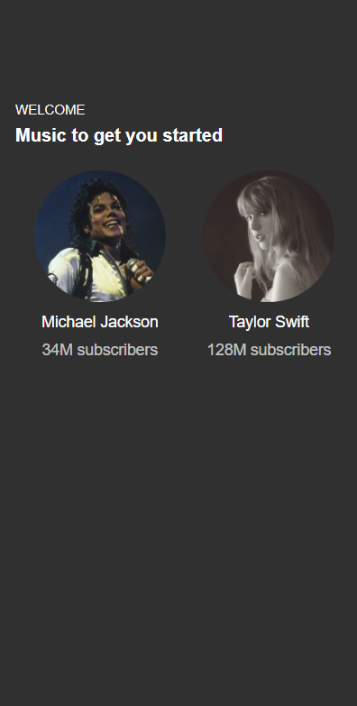
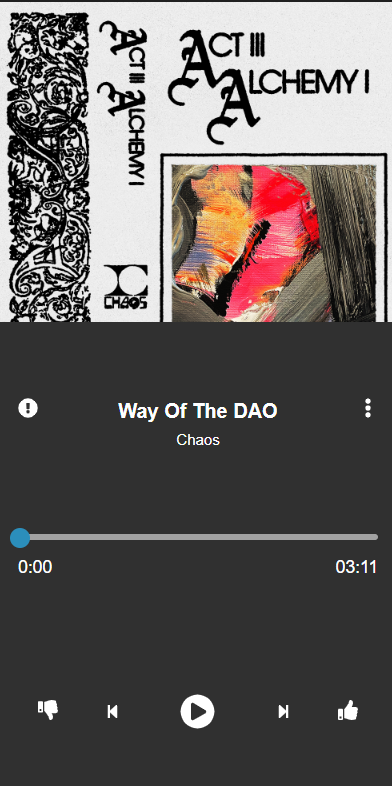

# Media Player

## Description
A media player component

## Screens

### Home



```typescript(source/home/index.tsx)
import { Styles, Module, CarouselSlider, FormatUtils } from "@ijstech/components";
import { customStyles } from "./index.css";
import { DataModel } from "./model";
const Theme = Styles.Theme.ThemeVars;

export default class MediaPlayer extends Module 
  private model: DataModel;
  render() {}
}
```

### Discover and Explore


```typescript(source/playlist/index.tsx)
import { Styles, Module, VStack, Control, customElements, ControlElement, Container, Label, FormatUtils } from "@ijstech/components";
const Theme = Styles.Theme.ThemeVars;
import { DataModel } from "./model";

export default class MediaPlayer extends Module 
  private model: DataModel;
  render() {}
}
```

### Audio Playback



```typescript(source/player/index.tsx)
import {
  ControlElement,
  customElements,
  Module,
  Styles,
  Container,
  Icon,
  Image,
  Label,
  Range,
  Panel,
  moment,
  Control,
  GridLayout
} from '@ijstech/components';
const Theme = Styles.Theme.ThemeVars;
import { DataModel } from './model';

export default class MediaPlayer extends Module 
  private model: DataModel;
  render() {}
}
```
