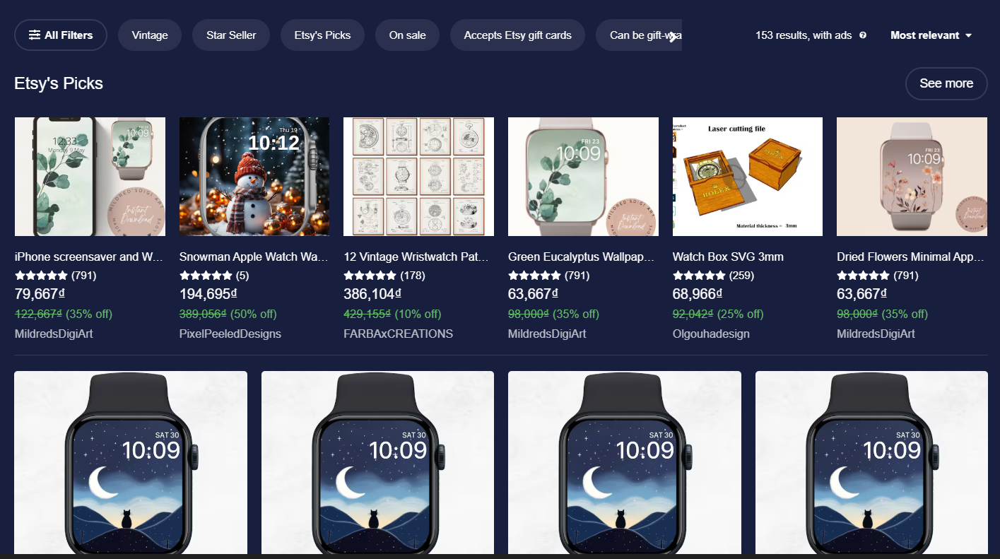

# Products

## Description
A products component

## Screens

### Home



## Source Code

```typescript(source/index.tsx)
import { Module, Styles, HStack, CardLayout, GridLayout, Panel, Control } from '@ijstech/components';
import { ProductModel } from './model';
import { Filter, IOption } from './components/index';
import { afterBlurStyle, beforeBlurStyle, customImageStyle, customTopProductsStyle, buttonHoveredStyle, closeIconStyle } from './index.css';

const Theme = Styles.Theme.ThemeVars;

export default class Products extends Module {
  private model: ProductModel;

  private filteredData: { [key: string]: any } = {
    itemType: ''
  };


  private pnlOptions: HStack;
  private productsGrid: GridLayout;
  private pnlPicked: GridLayout;
  private filterEl: Filter;
  private pnlFilter: Panel;
  private leftIcon: Panel;
  private rightIcon: Panel;
  private pnlFilterWrap: Panel;

  ...

  render() {
    return <i-vstack
      width='100%'
      gap={18}
      padding={{ "left": 16, "right": 16, "top": 16, "bottom": 16 }}
      background={{ "color": "var(--background-main)" }}
    >
      <i-hstack
        width='100%'
        gap={16}
        alignItems='center'
        horizontalAlignment='space-between'
        padding={{ "top": 8 }}
        overflow='hidden'
        position='relative'
      >
        <i-panel
          id='leftBlur'
          class={beforeBlurStyle}
          visible={false}
        >
        </i-panel>
        <i-panel
          id='leftIcon'
          cursor='pointer'
          visible={false}
          left={0}
          zIndex={10}
          onClick={this.onClickLeftIcon}
        >
          <i-icon
            name='angle-left'
            width={20}
            height={20}
            fill='var(--text-primary)'
            cursor='pointer'
          >
          </i-icon>
        </i-panel>
        <i-hstack
          alignItems='center'
          maxWidth='70%'
          position='relative'
        >
          <i-hstack
            id='pnlFilter'
            alignItems='center'
            maxWidth='100%'
            overflow='hidden'
            gap={12}
          >
            <i-button
              icon={{ "name": "sliders-h", "width": 13, "height": 13 }}
              caption='All Filters'
              minHeight={36}
              border={{ "radius": "24px", "width": "2px", "style": "solid", "color": "var(--divider)" }}
              padding={{ "top": "9px", "right": "15px", "bottom": "9px", "left": "15px" }}
              boxShadow='none'
              font={{ "size": "12px", "weight": "600" }}
              background={{ "color": "transparent" }}
              stack={{ "shrink": "0" }}
              onClick={this.showFilter}
              mediaQueries={[{ "maxWidth": "480px", "properties": { "visible": false } }]}
            >
            </i-button>
            <i-button
              visible={false}
              icon={{ "name": "sliders-h", "width": 13, "height": 13 }}
              minHeight={36}
              border={{ "radius": "24px", "width": "2px", "style": "solid", "color": "var(--divider)" }}
              padding={{ "top": "9px", "right": "15px", "bottom": "9px", "left": "15px" }}
              boxShadow='none'
              font={{ "size": "12px", "weight": "600" }}
              background={{ "color": "transparent" }}
              stack={{ "shrink": "0" }}
              onClick={this.showFilter}
              mediaQueries={[{ "maxWidth": "480px", "properties": { "visible": true } }]}
            >
            </i-button>
            <i-hstack
              id='pnlOptions'
              gap={12}
              alignItems='center'
              mediaQueries={[{ "maxWidth": "480px", "properties": { "visible": false } }]}
            >
            </i-hstack>
          </i-hstack>
          <i-panel
            id='rightBlur'
            class={afterBlurStyle}
            visible={false}
          >
          </i-panel>
          <i-panel
            id='rightIcon'
            cursor='pointer'
            visible={false}
            right={0}
            top={10}
            zIndex={10}
            onClick={this.onClickRightIcon}
          >
            <i-icon
              name='angle-right'
              width={20}
              height={20}
              fill='var(--text-primary)'
              cursor='pointer'
            >
            </i-icon>
          </i-panel>
        </i-hstack>
        <i-hstack
          position='relative'
          width='100%'
          gap={12}
          stack={{ "basis": "30%", "shrink": "0" }}
          alignItems='center'
          justifyContent='end'
          mediaQueries={[{ "maxWidth": "480px", "properties": { "stack": { "basis": "auto", "shrink": "1" } } }]}
        >
          <i-hstack
            gap={4}
            verticalAlignment='center'
          >
            <i-label
              caption='153 results, with ads'
              font={{ "size": "12px", "weight": 300 }}
              display='inline'
            >
            </i-label>
            <i-icon
              name='question-circle'
              width={12}
              height={12}
              tooltip={{ "content": "Content" }}
              padding={{ "left": 4 }}
              stack={{ "shrink": "0" }}
            >
            </i-icon>
          </i-hstack>
          <i-button
            padding={{ "top": "9px", "right": "15px", "bottom": "9px", "left": "15px" }}
            caption='Most relevant'
            stack={{ "shrink": "0" }}
            border={{ "radius": "24px" }}
            boxShadow='none'
            background={{ "color": "transparent" }}
            rightIcon={{ "width": 12, "height": 12, "fill": "var(--text-primary)", "name": "caret-down" }}
            font={{ "size": "12px", "weight": "600" }}
            class={buttonHoveredStyle}
          >
          </i-button>
        </i-hstack>
      </i-hstack>
      <i-hstack
        position='relative'
        width='100%'
        justifyContent='space-between'
        alignItems='center'
      >
        <i-label
          position='relative'
          caption="Etsy's Picks"
          font={{ "size": "19px", "weight": "500" }}
        >
        </i-label>
        <i-button
          minWidth='36px'
          minHeight='36px'
          padding={{ "top": "9px", "right": "15px", "bottom": "9px", "left": "15px" }}
          caption='See more'
          border={{ "radius": "24px", "width": "2px", "style": "solid", "color": "var(--divider)" }}
          background={{ "color": "transparent" }}
          font={{ "color": "var(--text-primary)" }}
          boxShadow='none'
        >
        </i-button>
      </i-hstack>
      <i-grid-layout
        id='pnlPicked'
        class={customTopProductsStyle}
        width='100%'
        gap={{ "row": "16px", "column": "16px" }}
        padding={{ "bottom": 16 }}
        templateColumns={["repeat(6, minmax(0, 1fr))"]}
        autoFillInHoles={true}
        border={{ "bottom": { "width": "1px", "style": "solid", "color": "var(--divider)" } }}
        mediaQueries={[{ "maxWidth": "767px", "properties": { "templateColumns": ["1fr"], "templateRows": ["auto"] } }, { "minWidth": "768px", "maxWidth": "1024px", "properties": { "templateColumns": ["repeat(3, minmax(0, 1fr))"] } }]}
      >
      </i-grid-layout>
      <i-grid-layout
        id='productsGrid'
        width='100%'
        templateColumns={["repeat(4, minmax(0, 1fr))"]}
        templateRows={["auto"]}
        autoFillInHoles={true}
        gap={{ "row": "16px", "column": "16px" }}
        mediaQueries={[{ "maxWidth": "767px", "properties": { "templateColumns": ["1fr"], "templateRows": ["auto"] } }, { "minWidth": "768px", "maxWidth": "1024px", "properties": { "templateColumns": ["repeat(2, minmax(0, 1fr))"] } }]}
      >
      </i-grid-layout>
    </i-vstack>
  }
} 
```